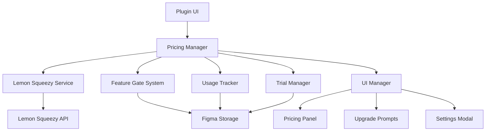

-. Design Document

-. Overview

This design outlines a comprehensive pricing strategy enhancement for the Figma plugin that builds upon the existing Lemon Squeezy integration. The system will support a flexible Free + Pro model with both one-time purchase and subscription options, allowing the plugin owner to start with simple pricing and evolve to more sophisticated models based on market feedback.

The design leverages the existing infrastructure (`LemonSqueezyService`, license validation, UI components) while adding new capabilities for feature gating, usage tracking, trial management, and flexible payment models.

-. Architecture

-. High-Level Architecture



-. Core Components

1. **Pricing Manager**: Central orchestrator for all pricing-related functionality
2. **Feature Gate System**: Controls access to premium features based on user tier
3. **Usage Tracker**: Monitors feature usage and enforces limits
4. **Trial Manager**: Handles free trial periods and transitions
5. **Payment Model Handler**: Supports both one-time and subscription payments
6. **UI Enhancement Layer**: Provides pricing displays and upgrade flows

-. Components and Interfaces

-. 1. Pricing Manager

**Purpose**: Central coordinator for all pricing functionality

```typescript
interface PricingManager {
  // Core functionality
  initialize(): Promise<void>;
  getUserTier(): Promise<UserTier>;
  checkFeatureAccess(feature: string): Promise<FeatureAccessResult>;
  
  // Payment model support
  getPricingOptions(): PricingOption[];
  generateCheckoutUrl(option: PricingOption, email?: string): string;
  
  // Trial management
  startTrial(): Promise<TrialResult>;
  getTrialStatus(): Promise<TrialStatus>;
  
  // License management
  validateLicense(key: string): Promise<LicenseValidationResult>;
  activateLicense(key: string): Promise<ActivationResult>;
}

interface UserTier {
  type: 'free' | 'trial' | 'pro_onetime' | 'pro_subscription';
  isActive: boolean;
  expiresAt?: Date;
  trialDaysRemaining?: number;
  features: string[];
  limits: UsageLimits;
}

interface PricingOption {
  id: string;
  type: 'onetime' | 'subscription';
  name: string;
  price: number;
  currency: string;
  interval?: 'monthly' | 'yearly';
  variantId: string;
  features: string[];
  popular?: boolean;
}
```

-. 2. Feature Gate System

**Purpose**: Controls access to premium features with graceful degradation

```typescript
interface FeatureGateSystem {
  checkAccess(feature: string): Promise<FeatureAccessResult>;
  enforceLimit(feature: string, action: string): Promise<LimitResult>;
  getUsageStatus(feature: string): Promise<UsageStatus>;
}

interface FeatureAccessResult {
  allowed: boolean;
  reason?: 'no_license' | 'trial_expired' | 'limit_exceeded' | 'feature_not_included';
  upgradeMessage?: string;
  upgradeOptions?: PricingOption[];
  remainingUsage?: number;
}

interface UsageLimits {
  maxBookmarks: number;
  maxEmojiSets: number;
  maxExportsPerDay: number;
  maxHistoryEntries: number;
  canUseAdvancedFeatures: boolean;
}
```

-. 3. Usage Tracker

**Purpose**: Monitors and enforces usage limits across different features

```typescript
interface UsageTracker {
  trackUsage(feature: string, amount?: number): Promise<void>;
  getUsage(feature: string, period?: 'daily' | 'monthly' | 'total'): Promise<number>;
  resetDailyUsage(): Promise<void>;
  canUseFeature(feature: string, amount?: number): Promise<boolean>;
}

interface UsageData {
  feature: string;
  count: number;
  lastUsed: Date;
  dailyCount: number;
  lastDailyReset: Date;
  monthlyCount: number;
  lastMonthlyReset: Date;
}
```

-. 4. Trial Manager

**Purpose**: Handles free trial periods and conversions

```typescript
interface TrialManager {
  isEligibleForTrial(): Promise<boolean>;
  startTrial(): Promise<TrialResult>;
  getTrialStatus(): Promise<TrialStatus>;
  extendTrial(days: number): Promise<void>;
  convertToSubscription(variantId: string): Promise<void>;
}

interface TrialStatus {
  isActive: boolean;
  startDate?: Date;
  endDate?: Date;
  daysRemaining?: number;
  hasUsedTrial: boolean;
  canExtend: boolean;
}
```

-. 5. Payment Model Handler

**Purpose**: Supports flexible payment options (one-time vs subscription)

```typescript
interface PaymentModelHandler {
  getAvailableModels(): PaymentModel[];
  configureModel(model: PaymentModel): Promise<void>;
  generateCheckoutUrl(model: PaymentModel, email?: string): string;
  validatePayment(licenseKey: string): Promise<PaymentValidationResult>;
}

interface PaymentModel {
  id: string;
  type: 'onetime' | 'subscription';
  name: string;
  description: string;
  price: number;
  currency: string;
  interval?: 'monthly' | 'yearly';
  variantId: string;
  features: string[];
  benefits: string[];
}
```

-. Data Models

-. Enhanced License State

```typescript
interface EnhancedLicenseState {
  // Basic license info
  licenseKey: string | null;
  isValid: boolean;
  type: 'onetime' | 'subscription' | null;
  
  // Subscription-specific
  subscriptionId?: string;
  customerId?: string;
  expiresAt?: Date;
  
  // One-time purchase specific
  purchaseDate?: Date;
  isPermanent?: boolean;
  
  // Trial info
  trialStatus: TrialStatus;
  
  // Validation metadata
  lastValidated: Date;
  validationAttempts: number;
  
  // Feature access cache
  cachedFeatures: string[];
  cacheExpiry: Date;
}
```

-. Pricing Configuration

```typescript
interface PricingConfig {
  // Current model
  activeModel: 'freemium' | 'onetime' | 'subscription' | 'hybrid';
  
  // Available options
  pricingOptions: PricingOption[];
  
  // Feature definitions
  features: {
    [key: string]: {
      name: string;
      description: string;
      tier: 'free' | 'pro';
      category: string;
      hasUsageLimit: boolean;
      dailyLimit?: number;
      monthlyLimit?: number;
    };
  };
  
  // Free tier limits
  freeLimits: UsageLimits;
  
  // Trial configuration
  trialConfig: {
    enabled: boolean;
    durationDays: number;
    features: string[];
    canExtend: boolean;
    maxExtensions: number;
  };
}
```

-. Usage Analytics

```typescript
interface UsageAnalytics {
  userId: string;
  sessionId: string;
  events: AnalyticsEvent[];
  summary: {
    totalSessions: number;
    featuresUsed: string[];
    upgradePromptsSeen: number;
    upgradeAttempts: number;
    conversionDate?: Date;
  };
}

interface AnalyticsEvent {
  type: 'feature_used' | 'limit_hit' | 'upgrade_prompt_shown' | 'upgrade_clicked' | 'trial_started';
  feature?: string;
  timestamp: Date;
  metadata?: Record<string, any>;
}
```

-. Error Handling

-. Graceful Degradation Strategy

1. **API Failures**: Use cached license status with grace periods
2. **Network Issues**: Allow continued usage for one-time licenses
3. **Validation Errors**: Provide clear user feedback and retry mechanisms
4. **Storage Failures**: Fallback to memory-based state with warnings

-. Error Recovery Patterns

```typescript
interface ErrorRecoveryHandler {
  handleApiError(error: ApiError): Promise<RecoveryAction>;
  handleValidationFailure(attempts: number): Promise<RetryStrategy>;
  handleStorageError(operation: string): Promise<FallbackStrategy>;
}

type RecoveryAction = 'use_cache' | 'retry' | 'degrade_gracefully' | 'show_error';
type RetryStrategy = 'immediate' | 'exponential_backoff' | 'user_initiated' | 'abandon';
type FallbackStrategy = 'memory_only' | 'local_storage' | 'disable_feature' | 'read_only';
```

-. User-Friendly Error Messages

```typescript
const ERROR_MESSAGES = {
  network_error: "Connection issue detected. Using cached license status.",
  validation_failed: "Unable to verify license. Please check your connection and try again.",
  api_error: "Service temporarily unavailable. Premium features may be limited.",
  storage_error: "Unable to save settings. Changes may not persist.",
  license_expired: "Your license has expired. Renew to continue using premium features.",
  trial_expired: "Your free trial has ended. Upgrade to continue using premium features."
};
```

-. Testing Strategy

-. Unit Testing

1. **Pricing Manager Tests**
   - User tier determination logic
   - Feature access validation
   - Payment model switching
   - Trial management workflows

2. **Feature Gate Tests**
   - Access control for different tiers
   - Usage limit enforcement
   - Graceful degradation scenarios
   - Error handling paths

3. **Usage Tracker Tests**
   - Usage counting accuracy
   - Daily/monthly reset logic
   - Limit enforcement
   - Data persistence

-. Integration Testing

1. **Lemon Squeezy Integration**
   - License validation flows
   - Checkout URL generation
   - Webhook handling
   - API error scenarios

2. **UI Integration**
   - Pricing panel display
   - Upgrade prompt triggers
   - Settings modal functionality
   - Trial status indicators

3. **Storage Integration**
   - State persistence
   - Cache invalidation
   - Migration scenarios
   - Cleanup procedures

-. User Acceptance Testing

1. **Free User Journey**
   - Feature discovery
   - Limit encounters
   - Upgrade prompts
   - Trial activation

2. **Premium User Journey**
   - License activation
   - Feature unlocking
   - Subscription management
   - Renewal processes

3. **Edge Cases**
   - Offline usage
   - License expiration
   - Payment failures
   - Account changes

-. Performance Testing

1. **License Validation Performance**
   - API response times
   - Cache hit rates
   - Background validation
   - Batch operations

2. **UI Responsiveness**
   - Pricing panel load times
   - Feature gate response
   - Usage tracking overhead
   - Memory usage patterns

## Implementation Phases

### Phase 1: Core Infrastructure (Week 1-2)
- Enhanced Pricing Manager
- Basic Feature Gate System
- Usage Tracker foundation
- Enhanced license state management

### Phase 2: Payment Model Support (Week 2-3)
- One-time purchase support
- Subscription model enhancements
- Flexible pricing configuration
- Checkout URL generation

### Phase 3: Trial System (Week 3-4)
- Trial eligibility checking
- Trial activation and management
- Trial-to-paid conversion flows
- Trial status UI components

### Phase 4: UI Enhancements (Week 4-5)
- Enhanced pricing panel
- Contextual upgrade prompts
- Usage status indicators
- Settings modal improvements

### Phase 5: Analytics & Optimization (Week 5-6)
- Usage analytics collection
- Conversion tracking
- A/B testing framework
- Performance monitoring

### Phase 6: Testing & Polish (Week 6-7)
- Comprehensive testing
- Error handling refinement
- Performance optimization
- Documentation completion

This design provides a robust foundation for implementing a flexible pricing strategy that can evolve with your business needs while maintaining excellent user experience and technical reliability.