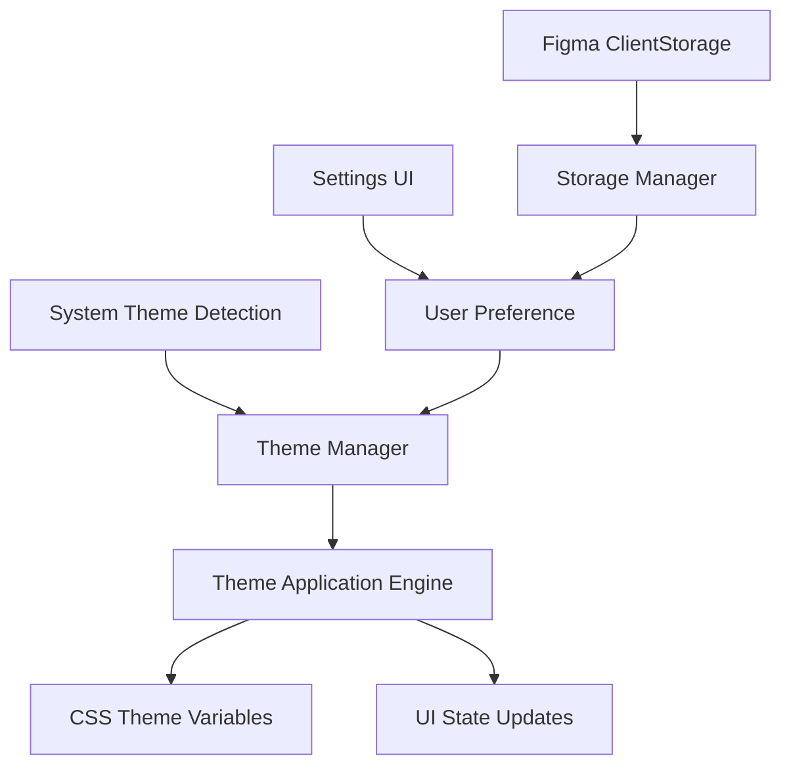

# Design Document

## Overview

The theme switching feature will enhance the existing theme system by adding intelligent system theme detection and merging the current Figma theme with a new light theme option. The system will provide three theme modes: System (auto-detect), Light, and Dark, while maintaining the existing custom themes (Boilerplate and Cybertron) for advanced users.

## Architecture

### Current State Analysis

The plugin currently has:
- **Theme Storage**: Uses Figma's `clientStorage` API for persistence via `code.ts`
- **Theme Application**: CSS-based theming using `data-theme` attributes on the HTML element
- **Theme Options**: Four themes (figma, light, boilerplate, cybertron)
- **UI Controls**: Radio button selection in settings overlay

### Proposed Architecture



## Components and Interfaces

### 1. System Theme Detection

**Interface: `SystemThemeDetector`**
```typescript
interface SystemThemeDetector {
  getCurrentSystemTheme(): 'light' | 'dark';
  onSystemThemeChange(callback: (theme: 'light' | 'dark') => void): void;
  removeSystemThemeListener(): void;
}
```

**Implementation Strategy:**
- Use `window.matchMedia('(prefers-color-scheme: dark)')` for detection
- Listen to media query changes for automatic updates
- Fallback to 'dark' if detection fails (current Figma default)

### 2. Enhanced Theme Manager

**Interface: `ThemeManager`**
```typescript
interface ThemeManager {
  currentTheme: ThemeMode;
  systemTheme: 'light' | 'dark';
  
  setTheme(mode: ThemeMode): Promise<void>;
  getEffectiveTheme(): EffectiveTheme;
  onThemeChange(callback: (theme: EffectiveTheme) => void): void;
}

type ThemeMode = 'system' | 'light' | 'dark' | 'boilerplate' | 'cybertron';
type EffectiveTheme = 'figma-light' | 'figma-dark' | 'light' | 'boilerplate' | 'cybertron';
```

**Key Responsibilities:**
- Manage theme preference state
- Coordinate between system detection and user preferences
- Handle theme transitions and persistence
- Emit theme change events for UI updates

### 3. Theme Application Engine

**Enhanced CSS Theme System:**
- **`figma-light`**: New theme that uses Figma's light theme variables
- **`figma-dark`**: Renamed from current 'figma' theme for clarity
- **`light`**: Standalone light theme (existing)
- **`boilerplate`**: Dark theme without Figma integration (existing)
- **`cybertron`**: Futuristic theme (existing)

### 4. Settings UI Enhancement

**New Theme Selection Options:**
```html
<div class="theme-selector">
  <label class="theme-option">
    <input type="radio" name="theme" value="system" id="theme-system" checked>
    <span class="theme-option-content">
      <span class="theme-icon">🔄</span>
      <span class="theme-name">System</span>
      <span class="theme-description">Match system preference</span>
    </span>
  </label>
  <label class="theme-option">
    <input type="radio" name="theme" value="light" id="theme-light">
    <span class="theme-option-content">
      <span class="theme-icon">☀️</span>
      <span class="theme-name">Light</span>
      <span class="theme-description">Always use light theme</span>
    </span>
  </label>
  <label class="theme-option">
    <input type="radio" name="theme" value="dark" id="theme-dark">
    <span class="theme-option-content">
      <span class="theme-icon">🌙</span>
      <span class="theme-name">Dark</span>
      <span class="theme-description">Always use dark theme</span>
    </span>
  </label>
  <!-- Advanced themes section -->
  <div class="advanced-themes">
    <label class="theme-option">
      <input type="radio" name="theme" value="boilerplate" id="theme-boilerplate">
      <!-- existing boilerplate theme -->
    </label>
    <label class="theme-option">
      <input type="radio" name="theme" value="cybertron" id="theme-cybertron">
      <!-- existing cybertron theme -->
    </label>
  </div>
</div>
```

## Data Models

### Theme Preference Model
```typescript
interface ThemePreference {
  mode: ThemeMode;
  lastSystemTheme?: 'light' | 'dark';
  migrationVersion?: number; // For future migrations
}
```

### Theme Configuration Model
```typescript
interface ThemeConfig {
  name: string;
  displayName: string;
  description: string;
  icon: string;
  cssDataAttribute: string;
  isSystemDependent: boolean;
}
```

## Error Handling

### System Theme Detection Failures
- **Fallback Strategy**: Default to 'dark' theme if system detection fails
- **Graceful Degradation**: Continue with manual theme selection if auto-detection is unavailable
- **Error Logging**: Log detection failures for debugging without breaking functionality

### Storage Failures
- **In-Memory Fallback**: Use session storage if Figma clientStorage fails
- **Default Preference**: Fall back to 'system' mode if no preference can be loaded
- **Silent Recovery**: Handle storage errors gracefully without user notification

### Theme Application Failures
- **CSS Fallback**: Ensure base theme variables are always available
- **Validation**: Validate theme names before application
- **Recovery**: Reset to default theme if invalid theme is detected

## Testing Strategy

### Unit Tests
1. **SystemThemeDetector**
   - Test media query detection
   - Test change event handling
   - Test fallback behavior

2. **ThemeManager**
   - Test theme preference persistence
   - Test system theme integration
   - Test theme change notifications

3. **Theme Application**
   - Test CSS attribute setting
   - Test theme variable application
   - Test transition smoothness

### Integration Tests
1. **End-to-End Theme Switching**
   - Test system theme detection on plugin load
   - Test manual theme override
   - Test preference persistence across sessions

2. **UI Integration**
   - Test settings panel theme selection
   - Test visual theme application
   - Test accessibility compliance

### Browser Compatibility Tests
1. **Media Query Support**
   - Test `prefers-color-scheme` support
   - Test fallback behavior in unsupported browsers
   - Test change event reliability

## Implementation Phases

### Phase 1: System Theme Detection
- Implement `SystemThemeDetector` class
- Add media query listeners
- Test detection reliability

### Phase 2: Theme Manager Enhancement
- Extend existing theme management
- Add system theme integration
- Implement new theme modes

### Phase 3: CSS Theme System Update
- Create `figma-light` theme variables
- Rename existing 'figma' to 'figma-dark'
- Ensure smooth theme transitions

### Phase 4: UI Updates
- Update settings panel with new options
- Implement theme selection logic
- Add visual feedback for active themes

### Phase 5: Migration and Polish
- Migrate existing user preferences
- Add transition animations
- Optimize performance

## Performance Considerations

### Theme Detection Optimization
- Cache system theme detection results
- Debounce system theme change events
- Minimize DOM queries during theme application

### CSS Performance
- Use CSS custom properties for efficient theme switching
- Minimize layout recalculations during theme changes
- Optimize theme variable inheritance

### Memory Management
- Clean up event listeners on plugin unload
- Avoid memory leaks in theme change callbacks
- Efficient storage of theme preferences

## Accessibility Compliance

### Color Contrast
- Ensure all themes meet WCAG AA contrast requirements
- Test with high contrast mode preferences
- Validate color combinations for accessibility

### User Preferences
- Respect `prefers-reduced-motion` for theme transitions
- Support `prefers-contrast: high` for enhanced visibility
- Maintain keyboard navigation during theme changes

### Screen Reader Support
- Announce theme changes to assistive technology
- Provide clear labels for theme options
- Maintain focus management during theme switching